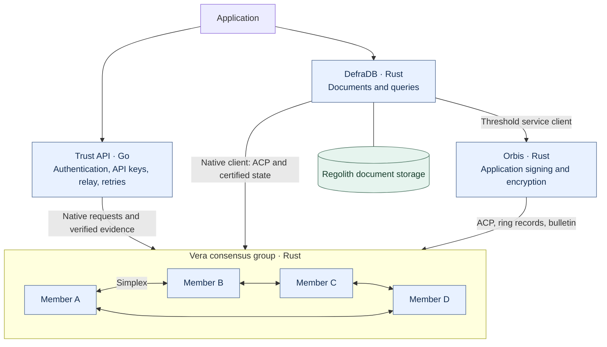
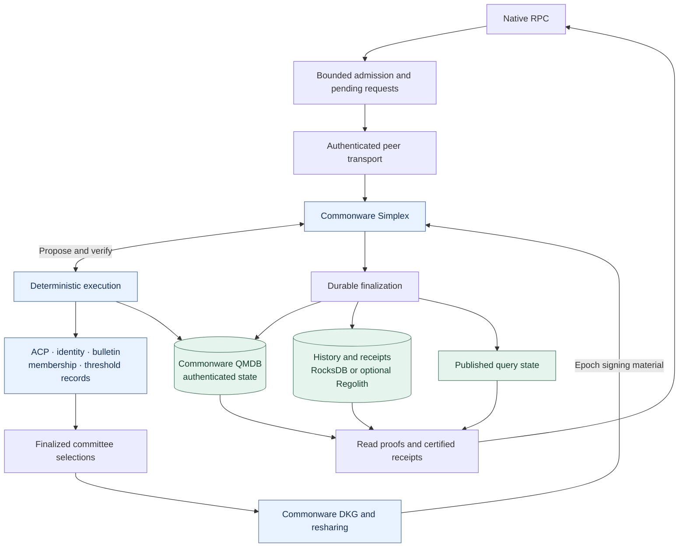
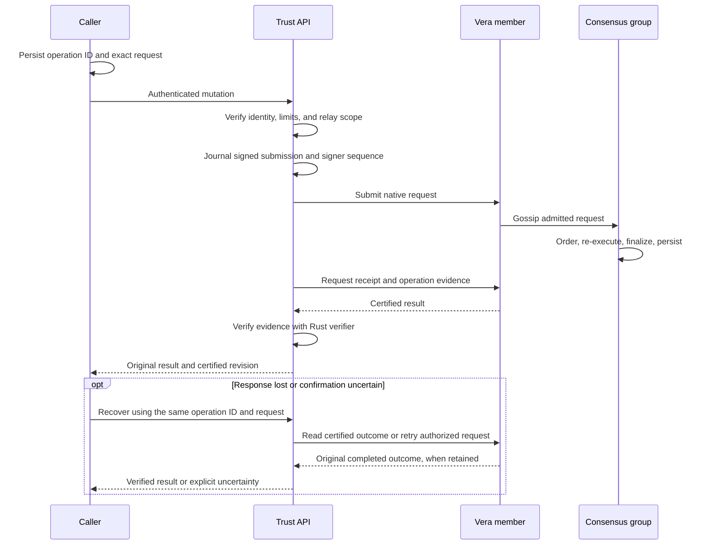
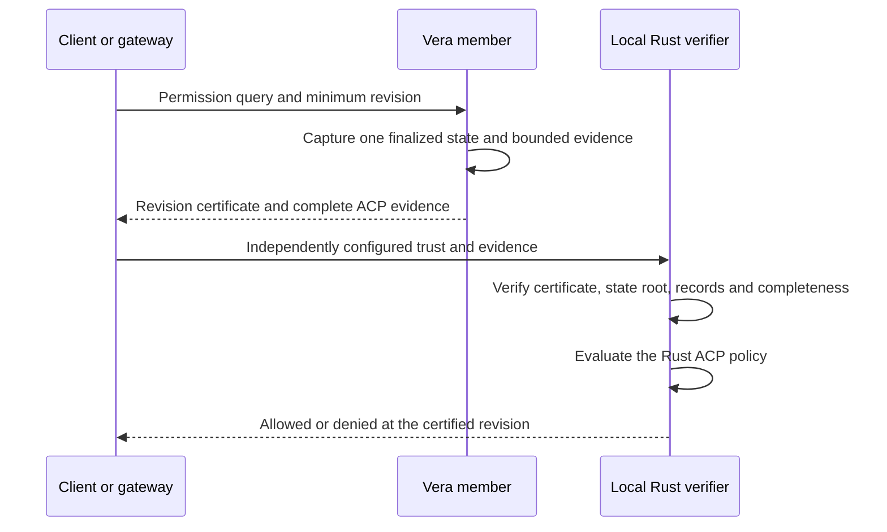
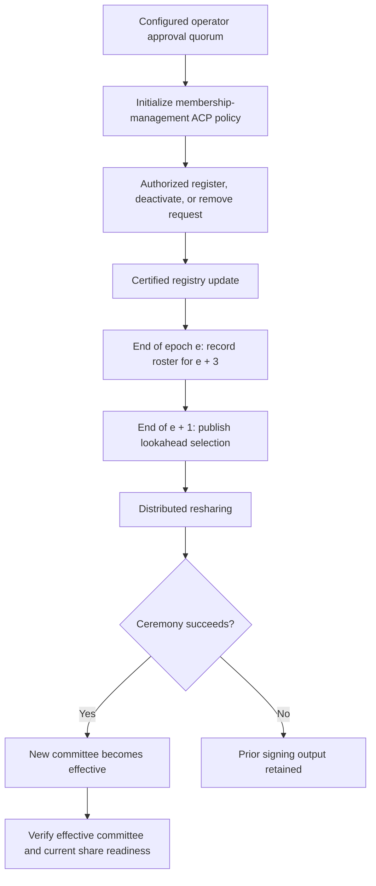
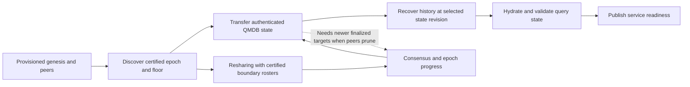

# Vera architecture

Vera is a replicated authorization and coordination service. Independent Rust
processes agree on ordered revisions, execute the same access-control rules, and
return results that clients can verify. Operators control consensus membership.
DefraDB stores application documents; Vera stores policies, relationships,
identities, coordination records, and their certified history.

This describes the native implementation. Recovery qualification, deployment
packaging, and sustained capacity measurements remain open. Implementation is
not a claim of production qualification.

## Service boundaries

The consensus links are illustrative; they do not prescribe a ring topology.
Trust is optional for clients that authenticate and sign native requests directly.
It is a separate service, never part of consensus. Its native gateway currently
exposes identity and ACP operations; native bulletin and Orbis routes are not
integrated there. Direct Rust clients use those services independently.

## Inside one member

ACP is implemented in Rust through the local `acp`, `zanzibar`, and `identity`
crates. All members re-execute proposals against isolated state before accepting
them. Durable finalization precedes publication of query results.

QMDB commits seven persistent partitions: accounts, storage, code, ACP, bulletin,
Vera records, and native signer sequences. A coordinated commitment binds the
native state root to their selected operation-log targets. Regolith is an optional
**history** backend; it does not replace QMDB's authenticated state. Query module
views currently materialize live records in memory, so dataset growth still
affects memory use. See [storage](history-storage.md).

## Write, confirmation, and retry

Admission is not confirmation. A timeout does not establish failure. Supported
delegated ACP operations bind the caller's operation ID and exact arguments to
their result; authorized retries return the original successful outcome without
reapplying its effects. Expired IDs cannot execute again. See
[operation identities](operation-identities.md).

Native Vera still enforces sequences per signing identity. Independent gateway
signers provide concurrent submission lanes; their durable journals prevent
sequence reuse after restart. Fee provisioning is unnecessary for this native
path. Reads and local policy validation do not allocate a submission lane.

## ACP reads

A remote permission boolean alone is insufficient. A permission read describes
the selected revision; it does not reserve future authority. Mutations check
authorization during execution. Stored access decisions have explicit issuance
and expiry semantics. See [permission proofs](permission-proofs.md) and
[access decisions](access-decisions.md).

## Operator-managed membership (PoA)

PoA describes who may join the consensus group. Commonware Simplex supplies
Byzantine fault-tolerant agreement within that group. Operator approval authority,
ACP permission to manage membership, and consensus signing shares are distinct.

A registry receipt alone does not prove admission. Operators must verify the
effective committee and the incoming process's current signing readiness before
reducing the existing quorum. Epoch length also limits committee size; the
registry's protocol cap is 64 entries. See [membership](consensus-membership.md).

## Two separate threshold systems

| System | Purpose | Authority and secrets |
|---|---|---|
| Commonware consensus DKG | Generate consensus shares and reshare across membership changes | Consensus group; local consensus secret store |
| Orbis application protocols | Application signing, encrypted secret recovery, participant replacement | Application rings; ACP permissions; separate application shares |

The bulletin carries authorized coordination messages. Vera also records ring,
participant, controller, and report state. Orbis executes the application
protocols. Commonware's DKG primitives do not supply those protocols wholesale;
consensus secrets must never serve as application keys. See
[threshold capabilities](threshold-capabilities.md).

## Snapshot recovery

Resharing runs during database initialization so epoch progress can supply newer
transfer targets when peers prune. Before execution rosters are available, the
membership provider reads the requested selection from a finalized epoch boundary
in the consensus archive and validates its height and selected epoch. Admission
and RPC still wait for database and history recovery. Startup supervision and a
configurable deadline bound failures; successful recovery still depends on peer
availability and retention.
Proposals are skipped and verification remains pending until execution state is
ready, before either can request speculative DKG artifacts.
The deliberately stale-target test still reaches the initialization deadline
inside database transfer. Epoch progress alone does not establish convergence;
this remains a recovery limitation.
See [snapshot recovery](snapshot-recovery.md) and [history storage](history-storage.md).

## Implementation map

| Concern | Source |
|---|---|
| Actor assembly and startup supervision | [`vera-node`](../crates/vera-node/src/node.rs) |
| Committee selection | [`participants.rs`](../crates/vera-node/src/participants.rs) |
| Proposal execution and finalized state | [`vera-app`](../crates/vera-app/src), [`vera-executor`](../crates/vera-executor/src) |
| Product rules | [`vera-modules`](../crates/vera-modules/src) |
| Native requests and verified reads | [`vera-client`](../crates/vera-client/src) |
| Shared verifier for Go consumers | [`vera-verifier`](../crates/vera-verifier/src) |

For deployment and diagnostics, start with [operating](operating.md). Performance
claims must distinguish submission capacity, finality latency, certified receipt
latency, and completed application workflows; see [workloads](native-workload.md).
