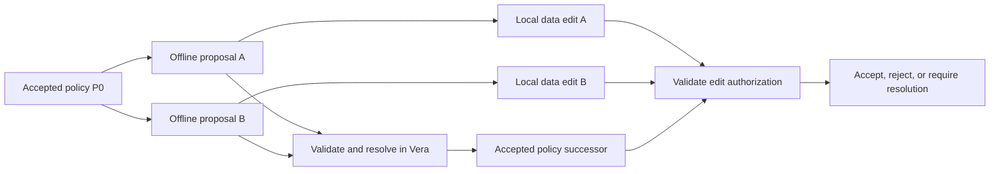

# Causal authorization

Status: agreed architectural direction; offline policy reconciliation is not
implemented. The existing native ACP remains the authorization mechanism. This
document distinguishes that implementation from the contracts required for the
next version. It does not define a new wire format or an offline grant.

## Decisions

Policy proposals and document edits retain their causal dependencies. Vera orders
authoritative acceptance and resolution. Concurrent proposals remain separate
history entries; ordering their arrival does not make one a descendant of the
other. Defra retains document history and reconciles document contents. Vera
governs the authorization state under which those edits can be accepted.

We retain the Rust relationship evaluator initially. Local evaluation and
distribution of authenticated evidence are separate from the policy language.
Removing a remote request from every check does not require replacing relation
tuples, group membership, or permission expressions.

We use the existing consensus group for authoritative ordering. No additional
Raft group or proof-of-history mechanism is introduced. Wall-clock timestamps
cannot decide which concurrent policy proposal is authorized. An expiry check,
if introduced, needs an explicit clock and validation rule.

Trust remains a separate Go gateway. An edge client must be able to authenticate
evidence without trusting the gateway. Commonware consensus certification does
not by itself authorize an application operation or provide Orbis decryption.

## Two histories, connected explicitly

Arrows from a policy proposal to a data edit express a declared authorization
dependency. They do not certify that proposal or confer its requested privileges.
An edit may be valid locally and remain provisional until reconciliation.

An immutable policy proposal must bind its format version, deployment identity,
policy identity, exact parent proposal identifiers, author, and exact change.
Its signature must cover these fields and the authority context used to submit
it. A content identifier must use a specified, domain-separated canonical
encoding; hashing arbitrary JSON or an unordered collection is insufficient.
The encoding, identifier algorithm, and size limits remain to be specified before
exposing an API.

A document edit must bind its document identity, data parents, author, operation,
and authorization context. That context includes the exact policy revision and
authenticated relationship, group, ownership, and delegation state on which the
decision depends. A policy-definition hash alone cannot describe those inputs.
Evidence for exclusions must establish complete relevant coverage, including
absence; a selected subset of favorable records is insufficient.

A signed dependency graph proves the dependencies an author declared. It does
not prove that the author had not seen a revocation, or that an edit was created
before a revocation. Backdated timestamps cannot establish either claim.

## Reconciliation contract

1. Bound decoding, parent count, evidence size, graph traversal, and evaluation
   before processing untrusted proposals. Verify deployment binding, content
   identifiers, signatures, and dependency integrity. Missing dependencies are
   unresolved input, never evidence of permission.
2. Authenticate the finalized anchor and its consensus membership history using
   configured trust. A peer-supplied key or revision is not its own trust anchor.
3. Verify the authority for each policy change against its authorized predecessor
   context. A proposal cannot use permissions it introduces to authorize itself.
   Concurrent branches must pass the defined conflict rule before becoming an
   accepted successor; successful parsing is insufficient.
4. Record the accepted predecessor, selected proposals, resulting state, and
   resolution outcome in the authoritative sequence. Preserve proposal identities
   and dependency links; do not relabel a rejected branch as accepted history.
5. Validate each dependent data edit separately. Successful document merging does
   not imply permission. Accept, reject, or retain the edit for explicit resolution
   according to the chosen offline-authority rules.

These are logical stages, not new RPC names. Consensus execution must produce
identical outcomes from identical state and inputs. State changes and their
outcomes must share the existing rollback and durable-finalization boundaries.
The retention and authenticated retrieval of proposal/resolution history need an
explicit storage design; current policy records are not that archive.

## Concurrent edits and revocation

Suppose Alice and Bob both branch from P0. Alice removes Bob's write permission
in A; Bob adds a collaborator in B and writes document D under B. B and D do not
become accepted merely because they reference P0, nor does Alice's submission
time prove that Bob created D later. Vera can order resolution, but the product
must define which authority survives this conflict.

The first-release choice is still open:

| Model | Consequence |
| --- | --- |
| Recheck current finalized authority on reconnect | Locally retained writes can be refused after revocation. Offline acceptance is provisional. |
| Explicit bounded offline grants | A grant can authorize specified operations despite later changes only under an explicitly defined revocation rule. Scope, duration or budget, delegation, and verification must be specified. |

Neither model can retract plaintext or keys already delivered to a disconnected
device. Future access to encrypted material also depends on Orbis and key
lifecycle behavior, not just policy reconciliation.

Concurrent changes to owners, grants, revocations, delegation, group membership,
and policy expressions have no implicit merge rule. Even edits to different
records can interact through a permission expression. Automatic merging requires
specified semantics and tests demonstrating preservation of authority. Until
then, concurrent proposals require explicit resolution; they must not silently
use last-writer-wins or union permissions.

## Existing functions and their boundaries

| Function | Current behavior | Boundary for causal authorization |
| --- | --- | --- |
| `AcpModule::create_policy` | Creates a policy record and compiled definition. | Does not create a causal proposal or offline grant. |
| `AcpModule::edit_policy` | Requires the stored owner, replaces the definition, preserves resource names, and prunes relationships for removed relations. | Takes no expected parent; does not retain a policy revision DAG. Existing online behavior remains unchanged. |
| `AcpModule::bearer_edit_policy` | Checks delegated authority before invoking the policy edit. | A worker signature does not make an offline branch authoritative. Any future parent/context fields must be included in the signed operation. |
| `evaluate_access_request` | Uses the shared Rust evaluator over fallible policy and relationship records. | Proof-backed callers must authenticate records and supply complete required evidence. |
| `verify_permission_proof` | Verifies bounded evidence and evaluates at a supplied root and height. | Caller must independently authenticate that finalized root; the result says nothing about later revocations. |
| `PermissionResponse::verify` | Authenticates finality, enforces the requested minimum revision, and verifies permission evidence. | Historical validity is not a grant to submit a later offline write. Caller owns additional freshness policy. |
| `VeraClient::verify_current_access` | Fetches evidence and verifies locally. | Still requires a remote request; not a disconnected check. |
| `VeraClient::verify_access_at` | Fetches evidence for a selected authenticated revision and verifies locally. | Also requires transport; it does not fetch or resolve an offline policy branch. |

Relevant implementations:
[policy handlers](../crates/vera-modules/src/acp/mod.rs),
[delegation](../crates/vera-modules/src/acp/delegation.rs),
[evaluator](../crates/vera-modules/src/acp/zanzibar_store.rs),
[proof verification](../crates/vera-permission/src/lib.rs),
[finality-bound response](../crates/vera-permission/src/response.rs), and
[client methods](../crates/vera-client/src/permission.rs).

The existing short-lived operation identity is for replay protection and outcome
lookup. It is not an offline capability and must not be extended into one merely
by increasing its expiry.

## Implementation gates

Before adding public request types, specify the offline-authority rule, canonical
encoding, conflict outcomes, and migration from existing mutable policy records.
Then implement parent-bound policy submissions through module execution, signed
native/delegated operations, receipts, proofs, and clients together. A new module
method alone would leave the externally usable path incomplete.

Qualification must cover same-parent concurrent edits; self-grant attempts;
revocation versus disconnected writes; changed group/delegation dependencies;
missing exclusion evidence; cross-deployment replay; duplicate submission;
malformed or oversized dependency graphs; unresolved parents; restart and crash
recovery; and deterministic outcomes across validators. Defra must demonstrate
that rejected authorization does not silently expose an otherwise merged edit.

No new causal request types, storage keys, merge behavior, or offline permissions
are enabled by this document.
